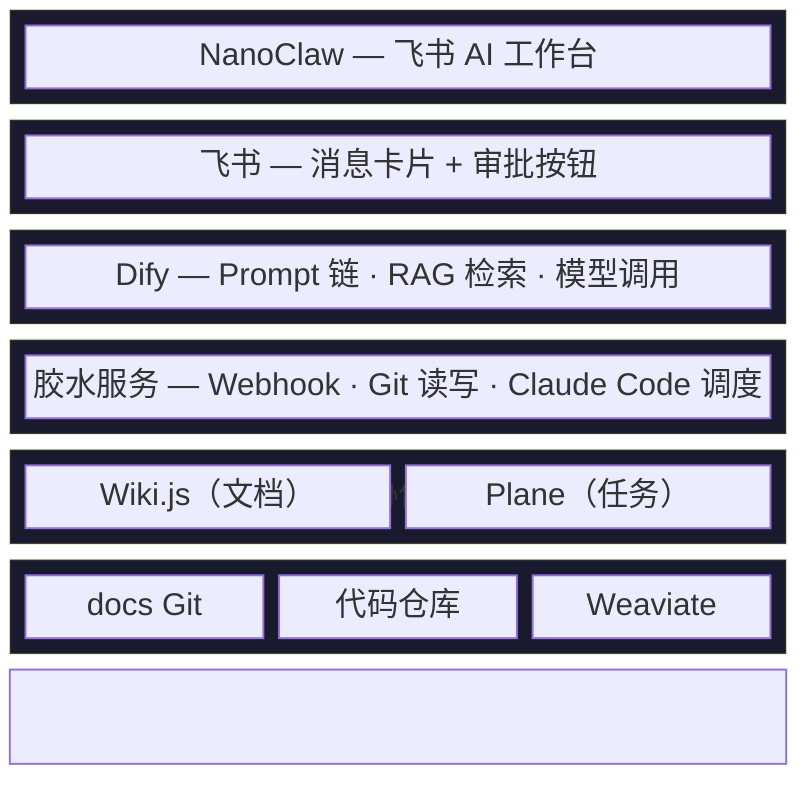
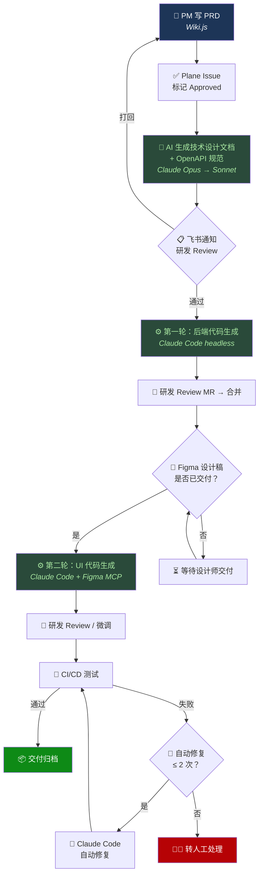

# ArcFlow

AI 研发运营一体化平台 — 以 Markdown + Git 为数据底座、AI 为执行引擎，串联从 PRD 到代码生成的全流程。

## 项目目标

1. **流程标准化** — PRD 到技术文档到代码的流程规范化，减少人工传递损耗
2. **研发效率** — AI 自动生成文档和代码，减少中间环节
3. **知识管理** — 文档统一存储，语义检索，降低信息查找成本

## 架构总览



## 核心数据流



## 技术栈

| 层 | 技术选型 |
|----|---------|
| 后端 | Java 17 + Spring Boot 3.x + MyBatis-Plus + MySQL 8.0 |
| Web 前端 | Vue3 + Element Plus / shadcn-vue + Pinia + Vite |
| 移动端 | Flutter 3.x + GetX + Dio |
| 客户端 | Kotlin Android（Jetpack Compose + XML） |
| 胶水服务 | Bun + Hono + bun:sqlite |
| AI 编排 | Dify（工作流 + RAG） |
| AI 引擎 | Claude API（Opus / Sonnet）+ Claude Code（headless） |
| 文档 | Wiki.js 2.x（Git 双向同步） |
| 任务管理 | Plane CE（原生 MCP） |
| AI 工作台 | NanoClaw（Claude Agent SDK） |
| 向量数据库 | Weaviate |

## 仓库结构

```text
ArcFlow/
├── packages/
│   ├── gateway/                        # 胶水服务（Bun + Hono）
│   │   ├── src/                        # 源码（路由、服务、中间件、数据库）
│   │   ├── Dockerfile
│   │   └── package.json
│   └── web/                            # Web 前端（Vue3 + Vite）
│       ├── src/                        # 源码（页面、组件、路由、状态管理）
│       ├── Dockerfile
│       └── package.json
├── docs/
│   ├── AI研发运营一体化平台_技术架构方案.md  # v1.0 原始架构方案
│   ├── claude-code-github-workflow-guide.md
│   ├── images/                         # 架构图
│   └── superpowers/specs/              # 详细设计规格文档（10 篇）
├── setup/                              # 第三方服务部署配置
│   ├── wiki-js/                        # Wiki.js docker-compose
│   ├── plane/                          # Plane CE docker-compose
│   ├── dify/                           # Dify docker-compose
│   ├── docs-repo/                      # docs 仓库初始化
│   └── claude-md/                      # 各端 CLAUDE.md 模板
├── .github/
│   ├── workflows/                      # CI（lint/test/security/AI review）
│   ├── CONTRIBUTING.md                 # 团队协作工作流
│   ├── PULL_REQUEST_TEMPLATE.md
│   └── ISSUE_TEMPLATE/
├── docker-compose.yml                  # 核心服务编排（gateway + web + wiki）
├── deploy.sh                           # 一键部署脚本
├── .env.example                        # 环境变量模板
├── CLAUDE.md                           # Claude Code 项目上下文
└── package.json                        # Monorepo 根配置
```

## 快速开始

### 环境要求

- [Bun](https://bun.sh/) >= 1.0
- [Node.js](https://nodejs.org/) >= 20（Web 前端构建）
- [Docker](https://www.docker.com/)（部署用）

### 本地开发

```bash
# 克隆仓库
git clone https://github.com/ssyamv/ArcFlow.git
cd ArcFlow

# 安装依赖
bun install

# 启动胶水服务（开发模式，端口 3100）
cd packages/gateway
cp .env.example .env   # 按需修改配置
bun run dev

# 启动 Web 前端（开发模式）
cd packages/web
bun run dev
```

### 代码检查与测试

```bash
# Lint（根目录执行，检查全部 packages）
bun run lint

# 格式化
bun run format

# 运行全部测试
bun run test
```

### Docker 部署

```bash
# 复制环境变量
cp .env.example .env

# 启动所有服务
docker compose up -d
```

服务端口：Gateway `3100` | Web `80` | Wiki.js `3000`

## 实施计划

| Phase | 内容 | 周期 | 状态 |
|-------|------|------|------|
| Phase 1 | Wiki.js + docs 仓库 + CLAUDE.md + CI/CD | Week 1-2 | 已完成 |
| Phase 2 | Plane CE + MCP 接入 | Week 3-4 | 待启动 |
| Phase 3 | Dify + 工作流 + 胶水服务 | Week 5-7 | 部分完成 |
| Phase 4 | Dify RAG 知识库 | Week 8-9 | 待启动 |
| Phase 5 | NanoClaw + 飞书接入 | Week 10-12 | 待启动 |
| Phase 6 | CI/CD Bug 回流 | Week 13-15 | 待启动 |

> Phase 1 基础设施已就绪；Phase 3 胶水服务核心框架（Webhook 路由、健康检查、数据库）和 Web 前端脚手架已完成。

## 参与开发

请阅读 [CONTRIBUTING.md](.github/CONTRIBUTING.md) 了解：

- 分支策略与命名规范
- Issue / PR 工作流
- Commit Message 规范
- Code Review 流程

当前开发任务见 [Phase 1 Milestone](https://github.com/ssyamv/ArcFlow/milestone/1)。

## License

[MIT](LICENSE)
