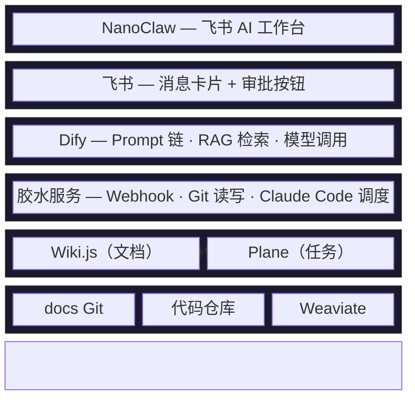
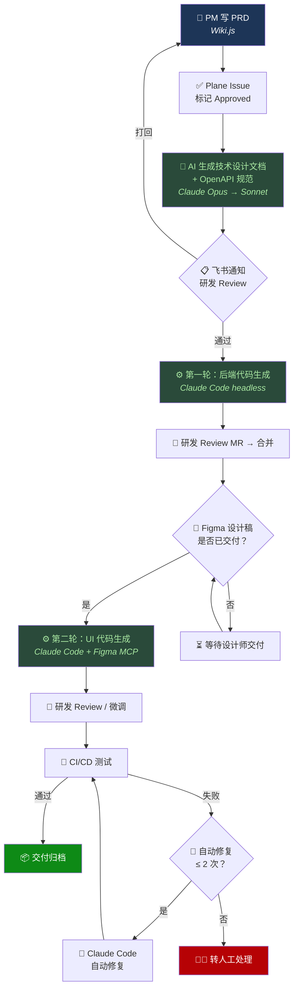

# ArcFlow

AI 研发运营一体化平台 — 以 Markdown + Git 为数据底座、AI 为执行引擎，串联从 PRD 到代码生成的全流程。

## 项目目标

1. **流程标准化** — PRD 到技术文档到代码的流程规范化，减少人工传递损耗
2. **研发效率** — AI 自动生成文档和代码，减少中间环节
3. **知识管理** — 文档统一存储，语义检索，降低信息查找成本

## 架构总览



## 核心数据流



## 技术栈

| 层 | 技术选型 |
|----|---------|
| 后端 | Java 17 + Spring Boot 3.x + MyBatis-Plus + MySQL 8.0 |
| Web 前端 | Vue 3 + Tailwind CSS + Pinia + Vue Router + Vite |
| 移动端 | Flutter 3.x + GetX + Dio |
| 客户端 | Kotlin Android（Jetpack Compose + XML） |
| 胶水服务 | Bun + Hono + bun:sqlite |
| AI 编排 | Dify（工作流 + RAG） |
| AI 引擎 | Claude API（Opus / Sonnet）+ Claude Code（headless） |
| 文档 | Wiki.js 2.x（Git 双向同步） |
| 任务管理 | Plane CE（原生 MCP） |
| AI 工作台 | NanoClaw（Claude Agent SDK） |
| 向量数据库 | Weaviate |

## 仓库结构

```text
ArcFlow/
├── CLAUDE.md                          # Claude Code 项目上下文
├── README.md
├── docker-compose.yml                 # 核心服务编排（Gateway + Web + Wiki.js）
├── deploy.sh                          # 一键部署脚本
├── .github/
│   ├── CONTRIBUTING.md                # 团队协作工作流
│   ├── PULL_REQUEST_TEMPLATE.md
│   ├── ISSUE_TEMPLATE/
│   │   ├── task.md
│   │   └── bug.md
│   └── workflows/
│       ├── ci.yml                     # CI（lint + test + 覆盖率）
│       ├── security.yml               # 安全扫描（gitleaks + audit + license）
│       ├── ai-review.yml              # AI Code Review（Claude Sonnet）
│       └── dependabot-auto-merge.yml  # Dependabot 自动合并
├── packages/
│   ├── gateway/                       # 胶水服务（Bun + Hono）
│   │   ├── src/
│   │   │   ├── index.ts               # 应用入口
│   │   │   ├── config.ts              # 环境变量配置
│   │   │   ├── scheduler.ts           # 定时清理任务
│   │   │   ├── db/                    # SQLite 数据层
│   │   │   ├── middleware/            # verify（HMAC）、dedup、logger
│   │   │   ├── routes/                # webhook、api、health
│   │   │   ├── services/              # dify、feishu、git、plane、wikijs、claude-code、workflow
│   │   │   └── types/                 # TypeScript 类型定义
│   │   └── Dockerfile
│   └── web/                           # 管理界面（Vue 3 + Tailwind CSS）
│       ├── src/
│       │   ├── api/                   # API 层（统一错误处理 + 类型）
│       │   ├── components/            # AppLayout
│       │   ├── lib/                   # cn() 工具函数
│       │   ├── pages/                 # Dashboard、WorkflowList、WorkflowTrigger、NotFound
│       │   ├── router/                # 路由（含 404 catch-all）
│       │   ├── stores/                # Pinia Store（含 error 状态）
│       │   └── utils/                 # 公共工具函数
│       └── Dockerfile
├── setup/                             # 第三方服务部署配置
│   ├── wiki-js/                       # Wiki.js docker-compose
│   ├── plane/                         # Plane CE docker-compose
│   ├── dify/                          # Dify + Weaviate docker-compose
│   ├── docs-repo/                     # docs 仓库目录脚手架
│   └── claude-md/                     # 各端 CLAUDE.md 模板
└── docs/
    ├── superpowers/
    │   ├── specs/                     # 详细设计规格文档（10 份）
    │   └── plans/                     # 实施计划文档
    └── claude-code-github-workflow-guide.md
```

## 开发进度

| Phase | 内容 | 周期 | 状态 |
|-------|------|------|------|
| Phase 1 | Wiki.js + docs 仓库 + CLAUDE.md | Week 1-2 | **已完成** |
| Phase 1.5 | 胶水服务核心框架 + Web 管理界面 + CI/CD | Week 2-3 | **已完成** |
| Phase 1.6 | Gateway Bug 修复与加固 + 服务层测试补全 | Week 3 | **已完成** |
| Phase 1.7 | Web 前端 Tailwind 重构 + 错误处理 | Week 3 | **已完成** |
| Phase 2 | Plane CE + MCP 接入 | Week 4-5 | 待启动 |
| Phase 3 | Dify + 工作流 + 胶水服务联调 | Week 6-8 | 待启动 |
| Phase 4 | Dify RAG 知识库 | Week 9-10 | 待启动 |
| Phase 5 | NanoClaw + 飞书接入 | Week 11-13 | 待启动 |
| Phase 6 | CI/CD Bug 回流 | Week 14-15 | 待启动 |

### 已完成的里程碑

### Phase 1 — 文档基础设施

- docs 仓库目录脚手架（prd / tech-design / api / arch / ops / market）
- 各端 CLAUDE.md 模板（backend / vue3 / flutter / android / docs）
- PRD 模板 + 技术设计文档模板
- 10 份详细设计规格文档

### Phase 1.5 — 胶水服务 + Web 界面 + CI/CD

- Gateway 胶水服务（Bun + Hono + SQLite）
  - 4 条 Webhook 路由（Plane / Git / CI/CD / 飞书）
  - 4 条工作流编排（PRD→技术文档 / 技术文档→OpenAPI / Bug 分析 / 代码生成）
  - 7 个外部服务集成（Dify / 飞书 / Git / Plane / Wiki.js / Claude Code / Workflow）
- Web 管理界面（Vue 3）
  - 系统概览 Dashboard（健康检查 + 工作流统计）
  - 工作流执行记录（筛选 + 列表）
  - 手动触发工作流
- Docker Compose 编排（Gateway + Web + Wiki.js）
- CI/CD 流水线（lint / test / 覆盖率 80% / AI Review / 安全扫描）

### Phase 1.6 — Gateway Bug 修复与加固

- P0：API 手动触发接入 `triggerWorkflow()` 实际执行工作流
- P0：`createBranchAndPush` 改用 `git add -A` 修复空文件提交
- P1：Webhook 签名验证改用 HMAC-SHA256 + `timingSafeEqual`
- P1：Wiki.js 同步 mutation 修正为 `storage { executeAction }`
- P2：Dify 支持多工作流独立 API Key（回退兼容单 Key）
- 新增 24 个服务层单元测试（feishu / plane / claude-code / wikijs / dify / git）
- 测试总数 62 个，覆盖 13 个测试文件

### Phase 1.7 — Web 前端升级

- 引入 Tailwind CSS v4（`@tailwindcss/vite` 插件方式）
- 全部页面从 scoped CSS 迁移到 Tailwind 工具类
- API 层统一 `request<T>()` 封装 + `ApiError` + 完整类型定义
- Store 新增 `error` 状态，API 失败有用户提示
- 抽取 `typeLabel` / `statusColors` 公共工具函数
- 新增 404 页面 + catch-all 路由
- 触发工作流页面新增错误提示 + 成功后表单重置

### CI/CD 安全策略

- 外部 Fork PR 需 Maintainer 打 `approved-for-ci` 标签后才触发 CI 和 AI Review
- Dependabot PR 跳过 AI Review，自动合并

## 参与开发

请阅读 [CONTRIBUTING.md](.github/CONTRIBUTING.md) 了解：

- 分支策略与命名规范
- Issue / PR 工作流
- Commit Message 规范
- Code Review 流程
- 外部贡献者 Fork PR 流程

## License

[MIT](LICENSE)
