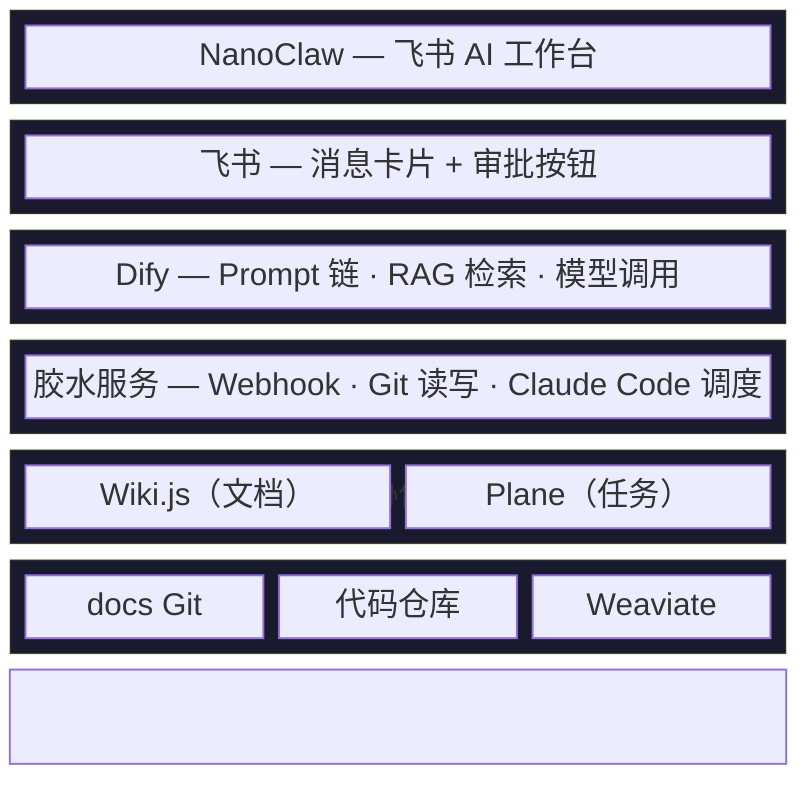
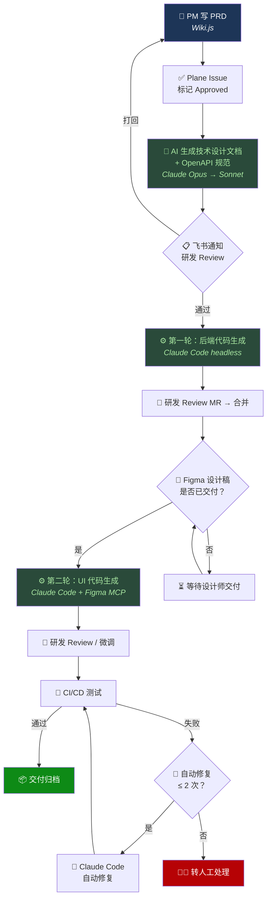

# ArcFlow

AI 研发运营一体化平台 — 以 Markdown + Git 为数据底座、AI 为执行引擎，串联从 PRD 到代码生成的全流程。

## 项目目标

1. **流程标准化** — PRD 到技术文档到代码的流程规范化，减少人工传递损耗
2. **研发效率** — AI 自动生成文档和代码，减少中间环节
3. **知识管理** — 文档统一存储，语义检索，降低信息查找成本

## 架构总览



## 核心数据流



## 技术栈

| 层 | 技术选型 |
|----|---------|
| 后端 | Java 17 + Spring Boot 3.x + MyBatis-Plus + MySQL 8.0 |
| Web 前端 | Vue3 + Element Plus / shadcn-vue + Pinia + Vite |
| 移动端 | Flutter 3.x + GetX + Dio |
| 客户端 | Kotlin Android（Jetpack Compose + XML） |
| 胶水服务 | Bun + Hono + bun:sqlite |
| AI 编排 | Dify（工作流 + RAG） |
| AI 引擎 | Claude API（Opus / Sonnet）+ Claude Code（headless） |
| 文档 | Wiki.js 2.x（Git 双向同步） |
| 任务管理 | Plane CE（原生 MCP） |
| AI 工作台 | NanoClaw（Claude Agent SDK） |
| 向量数据库 | Weaviate |

## 仓库结构

```
arcfrow/
├── CLAUDE.md                          # Claude Code 项目上下文
├── README.md
├── .github/
│   ├── CONTRIBUTING.md                # 团队协作工作流
│   ├── PULL_REQUEST_TEMPLATE.md
│   └── ISSUE_TEMPLATE/
│       ├── task.md
│       └── bug.md
└── docs/
    ├── AI研发运营一体化平台_技术架构方案.md  # v1.0 原始架构方案
    ├── images/                         # 架构图
    └── superpowers/specs/              # 详细设计规格文档
        ├── 2026-04-02-ai-devops-platform-design.md       # 整体平台设计（v2.1）
        ├── 2026-04-02-document-templates-design.md       # PRD + 技术文档模板
        ├── 2026-04-02-claude-md-specs-design.md          # 各端 CLAUDE.md 规范
        ├── 2026-04-02-dify-workflow-prompts-design.md    # Dify 工作流 Prompt
        ├── 2026-04-02-gateway-service-design.md          # 胶水服务详细设计
        ├── 2026-04-02-feishu-approval-design.md          # 飞书消息卡片 + 审批协议
        ├── 2026-04-02-multi-platform-codegen-design.md   # 多端代码生成策略
        └── 2026-04-02-nanoclaw-routing-design.md         # NanoClaw 意图路由
```

## 实施计划

| Phase | 内容 | 周期 | 状态 |
|-------|------|------|------|
| Phase 1 | Wiki.js + docs 仓库 + CLAUDE.md | Week 1-2 | 进行中 |
| Phase 2 | Plane CE + MCP 接入 | Week 3-4 | 待启动 |
| Phase 3 | Dify + 工作流 + 胶水服务 | Week 5-7 | 待启动 |
| Phase 4 | Dify RAG 知识库 | Week 8-9 | 待启动 |
| Phase 5 | NanoClaw + 飞书接入 | Week 10-12 | 待启动 |
| Phase 6 | CI/CD Bug 回流 | Week 13-15 | 待启动 |

## 参与开发

请阅读 [CONTRIBUTING.md](.github/CONTRIBUTING.md) 了解：

- 分支策略与命名规范
- Issue / PR 工作流
- Commit Message 规范
- Code Review 流程

当前开发任务见 [Phase 1 Milestone](https://github.com/ssyamv/arcfrow/milestone/1)。

## License

待定
